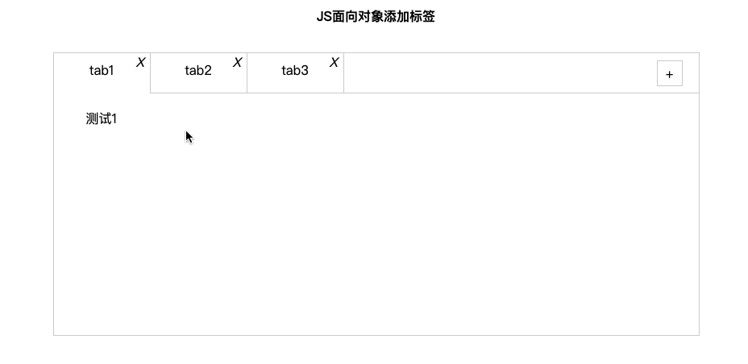
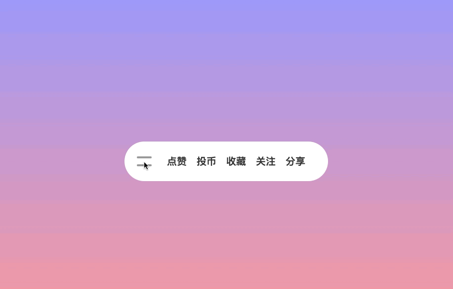
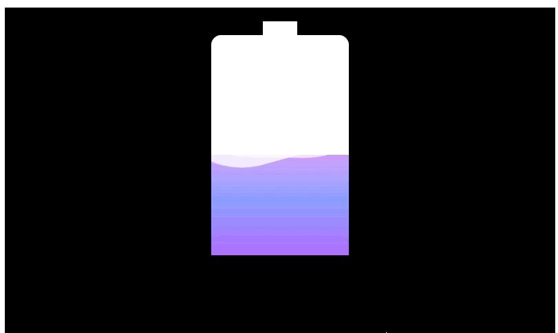
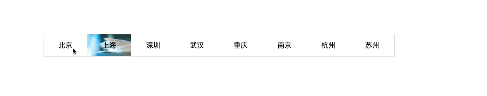

# cssAnimate
css的动画效果展示

>背景持续渐变

>圆形渐变加载

>炫彩button

>爱心加载

>移动星空

>色彩板

>刮刮乐

>侧边栏导航

>图片懒加载
** 需要注意的是根据图片的显示可以观察到这里并不是应为滚动条接触到了地步才显示的图片,而单是图片的位置显示在页面的客气范围是才加载出来的 **

>面相对象的方式动态添加导航菜单

>伸缩导航

>充电效果

>放大镜

>筋斗云

